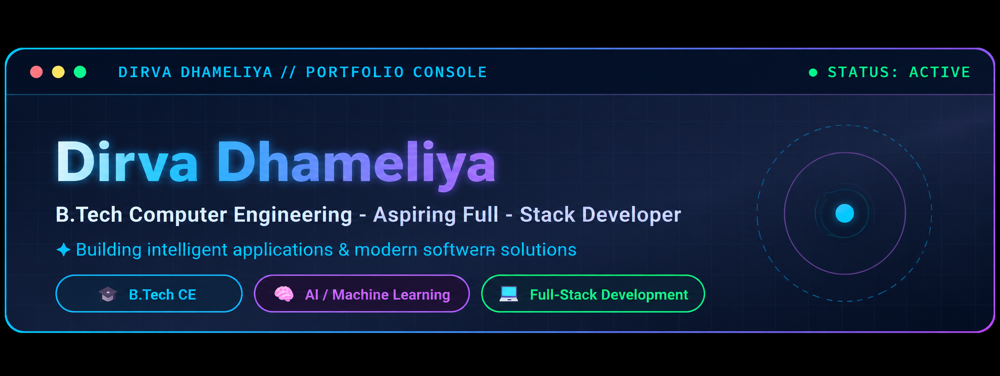

<!-- ========================================================= -->
<!--                    HEADER / BANNER                         -->
<!-- ========================================================= -->

 

 

---

# 🚀 Developer Command Center

> *"Engineering practical software systems while continuously expanding my capabilities in Full-Stack Development, Artificial Intelligence, Machine Learning and Data Structures."*

╔══════════════════════════════════════════════════════════════════════════════════════╗
║                                DIRVA DHAMELIYA // PROFILE                            ║
╠══════════════════════════════════════════════════════════════════════════════════════╣
║ ► ACADEMIC STATUS   : B.Tech Student in Computer Engineering                         ║
║ ► TARGET ROLE       : AI/ML Engineer • Frontend Devloper                             ║
║ ► CORE COMPETENCIES : Python, Java, Data Structures, Machine Learning, SQL           ║
║ ► CURRENT FOCUS     : Natural Language Processing, Computer Vision & Full-Stack Web  ║
║ ► AVAILABILITY      : Open for  Frontend Devloper & AI/ML Internships                ║
╚══════════════════════════════════════════════════════════════════════════════════════╝

<!-- ========================================================= -->
<!--              🚀 MISSION CONTROL / PROJECTS                -->
<!-- ========================================================= -->

<h2>🚀 Mission Control // Featured Projects</h2>

<table>
<tr>

<td width="50%" valign="top">

<h3>🚜 01. KrishiMitra</h3>

<b>Domain:</b> AI &amp; Full-Stack Development

<b>Tech:</b>
<code>Python</code>
<code>React</code>
<code>Node.js</code>
<code>Express.js</code>
<code>MongoDB</code>
<code>AI APIs</code>

<ul>
<li>AI platform for crop health and farm management.</li>
<li>Image-based crop disease detection with treatment recommendations.</li>
<li>AI agriculture assistant powered by Ollama (Qwen3).</li>
</ul>

</td>

<td width="50%" valign="top">

<h3>🏫 02. Smart Campus</h3>

<b>Domain:</b> Education Management

<b>Tech:</b>
<code>Python</code>
<code>Streamlit</code>
<code>SQLite</code>

<ul>
<li>Digital platform for managing college academic activities.</li>
<li>Role-based login for Students, Faculty, and HOD.</li>
<li>SQLite database for student, faculty, and attendance records.</li>
</ul>

</td>

</tr>

<tr>

<td width="50%" valign="top">

<h3>🏥 03. Hospital Management System</h3>

<b>Domain:</b> Healthcare &amp; Database Management

<b>Tech:</b>
<code>Java</code>
<code>DBMS</code>

<ul>
<li>Manages patient records, doctors, and appointments.</li>
<li>Uses data structures for efficient data management.</li>
<li>Built with modular object-oriented programming.</li>
</ul>

</td>

<td width="50%" valign="top">

<h3>🎫 04. Event Management System</h3>

<b>Domain:</b> Event Management &amp; Web Development

<b>Tech:</b>
<code>HTML</code>
<code>CSS</code>
<code>JavaScript</code>

<ul>
<li>Responsive website for managing college events.</li>
<li>Event registration and participant management.</li>
<li>Supports academic, technical, cultural, and sports events.</li>
</ul>

</td>

</tr>
</table>

</td>

</tr>
</table>
